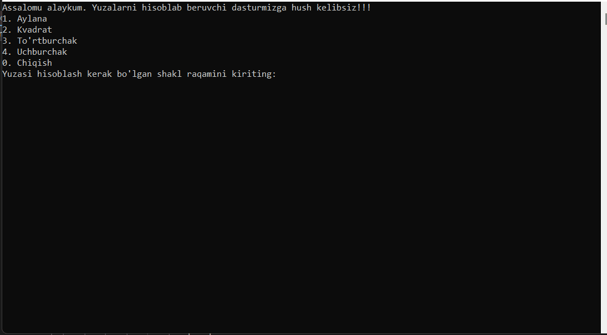

# GeometricGuru

Bu loyiha geometrik shakllarning yuzasi va perimetrini hisoblaydigan console dastur. 

  

## Qanday ishlatish

1. Dastur ishga tushirilganda menu chiqadi.
2. Shakl tanlanadi va kerakli o‘lchamlar kiritiladi.
3. Dastur yuzani va perimetrni hisoblab beradi.

## Klasslar
- `Circle` – aylana
- `Square` – kvadrat
- `Rectangle` – to‘rtburchak
- `Triangle` – uchburchak

## Texnologiyalar
- C#
- .NET
